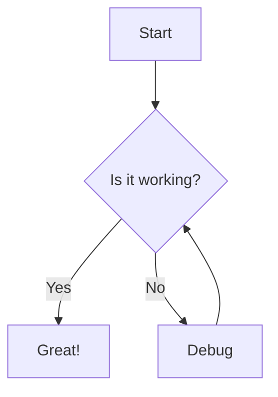

# GitBook Features

TerminalDocs supports GitBook-like syntax for creating rich, interactive documentation. This guide covers all the GitBook-like features available in TerminalDocs.

## Hint Blocks

Hint blocks are colored containers that help highlight important information. TerminalDocs supports four types of hint blocks:


**Info blocks (blue)** are used for general information, notes, and definitions.



**Warning blocks (yellow)** are used to warn users about potential issues or things to be careful about.



**Danger blocks (red)** are used to alert users about critical issues or destructive actions.



**Success blocks (green)** are used for tips, best practices, or successful outcomes.


### How to Use Hint Blocks

To create a hint block in your markdown files, use the following syntax:

```markdown

Your content here

```

Replace `TYPE` with one of the following:
- `info` - Blue information block
- `warning` - Yellow warning block
- `danger` - Red danger block
- `success` - Green success block

## Tabs

Tabs allow you to organize content into different sections that users can switch between. This is useful for showing different examples, platforms, or languages.

### How to Use Tabs

To create tabs in your markdown files, use the following syntax:

```markdown


function greet(name) {
  return `Hello, ${name}!`;
}



def greet(name):
    return f"Hello, {name}!"


```

This will create a tabbed interface where users can switch between different tabs.

## Cards

Cards are useful for creating visual navigation elements or highlighting related content.

### How to Use Cards

You can create cards using HTML with Tailwind CSS classes:

```html
<div class="grid grid-cols-1 md:grid-cols-2 gap-4">
  <div class="border rounded-lg p-4 hover:shadow-md transition-shadow">
    <h3 class="text-lg font-semibold">Getting Started</h3>
    <p>Learn how to install and set up TerminalDocs.</p>
    <a href="/docs/getting-started" class="text-blue-500 hover:underline">Read more →</a>
  </div>
</div>
```

## File Trees

File trees help visualize directory structures and file organization.

### How to Use File Trees

To create a file tree, use a code block with no language specified:

```
project/
├── docs/
│   ├── getting-started.md
│   └── advanced.md
├── src/
│   ├── components/
│   │   ├── Header.js
│   │   └── Footer.js
│   └── pages/
│       ├── index.js
│       └── about.js
└── package.json
```

The key is to use the following characters to create the tree structure:
- `├──` for items that have siblings below them
- `│   ` for vertical lines
- `└──` for the last item in a directory
- Indent with spaces to maintain alignment

## API Method Blocks

API method blocks help document APIs in a consistent and readable format.

### How to Use API Method Blocks

Use markdown headings, tables, and code blocks to create API documentation:

```markdown
### `GET /api/users`

Get a list of all users.

**Parameters:**

| Name | Type | Description |
|------|------|-------------|
| `page` | number | Page number (default: 1) |
| `limit` | number | Number of items per page (default: 10) |

**Response:**

{
  "users": [
    {
      "id": 1,
      "name": "John Doe",
      "email": "john@example.com"
    }
  ],
  "total": 1,
  "page": 1,
  "limit": 10
}
```

## Expandable Sections

Expandable sections allow you to hide content that might be too detailed for all users.

### How to Use Expandable Sections

Use HTML `<details>` and `<summary>` tags:

```markdown
<details>
<summary>Click to see implementation details</summary>

### Implementation Details

This feature is implemented using the HTML `<details>` and `<summary>` tags.

function implementFeature() {
  // Complex implementation details
  const data = fetchData();
  return processData(data);
}

</details>
```

## Mermaid Diagrams

Mermaid allows you to create diagrams using text-based syntax.

### How to Use Mermaid Diagrams

Use a code block with the language set to `mermaid`:

```markdown

```

## Math Equations

You can include mathematical equations using LaTeX syntax.

### How to Use Math Equations

Use `$` for inline equations and `$$` for block equations:

```markdown
Inline equation: $E = mc^2$

Block equation:

$$
\frac{d}{dx}(e^x) = e^x
$$
```

## Combining Features

You can combine these features to create rich, interactive documentation. For example, you can use tabs inside hint blocks:

```markdown

### Installation Options



npm install terminaldocs



yarn add terminaldocs



```

## Conclusion

These GitBook-like features help you create more engaging and interactive documentation. Experiment with them to find the best way to present your content to your users.


Remember that the goal of documentation is to help users understand your product or service. Use these features to enhance understanding, not to distract from the content.
 