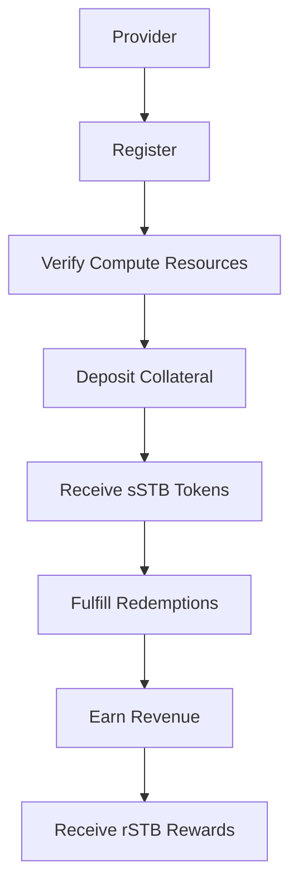
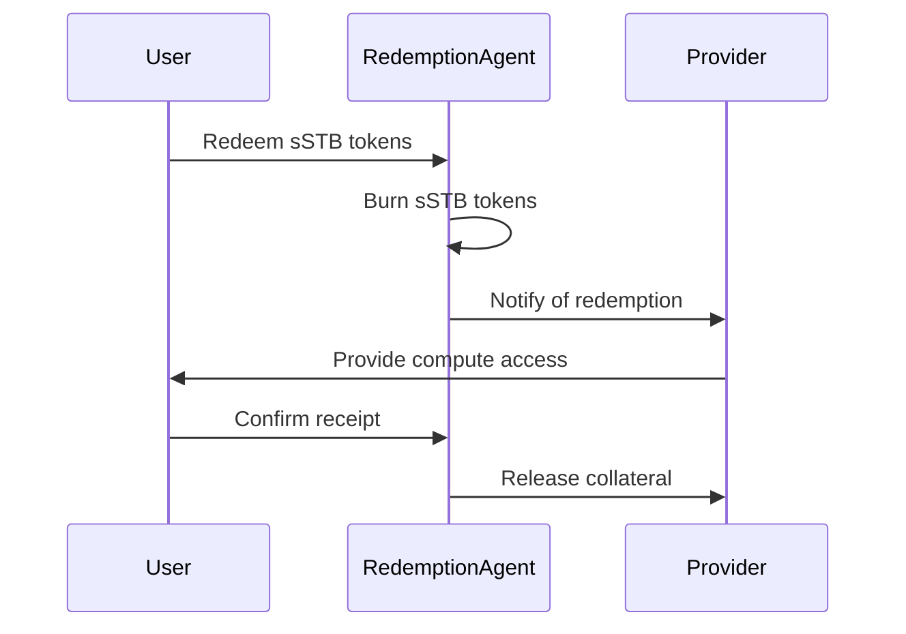

# Provider Guide

This guide explains how to become a compute provider in the STAB3L ecosystem, from registration to offering compute resources and fulfilling redemption requests.


Compute providers are the backbone of the STAB3L ecosystem, offering standardized compute resources that back the sSTB stablecoin and can be redeemed by users.



**Important**: CU tokens are NOT tradable assets. They are temporary tokens that are burned immediately when exchanged for sSTB. This burning mechanism is crucial for maintaining the peg and ensuring that each sSTB is backed by real compute resources.


## Provider Overview

As a STAB3L compute provider, you can:

- Offer your compute resources as standardized Compute Units (CUs)
- Receive sSTB tokens when your compute resources are verified and accepted
- Earn revenue from users redeeming sSTB tokens for your compute resources
- Earn rSTB rewards for providing reliable compute resources



## Becoming a Provider

### Registration Process



1. Connect your wallet to the STAB3L platform
2. Navigate to the "Provider" section
3. Click on "Register as Provider"
4. Fill in your provider details:
   - Provider name
   - Contact information
   - Company details (if applicable)
   - Hardware specifications
   - Geographic location
5. Submit your registration
6. Wait for approval from the STAB3L governance



```javascript
// Example API call to register as a provider
const response = await fetch('https://api.stab3l.com/provider/register', {
  method: 'POST',
  headers: {
    'Content-Type': 'application/json',
    'Authorization': `Bearer ${token}`
  },
  body: JSON.stringify({
    name: 'Example Provider',
    contactEmail: 'provider@example.com',
    companyName: 'Example Computing Inc.',
    hardwareSpecifications: {
      cpuType: 'AMD EPYC 7763',
      cpuCores: 64,
      ramGB: 512,
      storageGB: 10000,
      networkMbps: 10000
    },
    location: {
      country: 'United States',
      region: 'US-East'
    }
  })
});
```



### Provider Requirements

To become a STAB3L provider, you must meet the following requirements:

| Requirement | Description | Minimum Value |
|-------------|-------------|---------------|
| Hardware | Compute resources to offer | Server-grade hardware |
| Uptime | Guaranteed availability | 99.9% |
| Network | Network connectivity | 1 Gbps |
| Security | Security measures | Industry standard |
| Collateral | Collateral for staking | 120% of CU value |
| Identity | KYC verification | Required for large providers |


Provider requirements are enforced through the governance process. Providers who fail to meet these requirements may face penalties, including collateral slashing.


## Verifying Compute Resources

Before offering your compute resources, you must verify them through one of two methods:

### Zero-Knowledge Proof (ZKP) Verification



1. Download the STAB3L ZKP benchmarking tool

2. Run the tool on your compute resources

3. The tool generates benchmark results and a zero-knowledge proof

4. Submit the proof to the STAB3L platform

5. Verifiers check the proof's validity

6. If valid, your compute resources are verified



- Linux-based operating system

- Root access to the machine

- Internet connectivity

- Minimum 30 minutes of uninterrupted benchmarking time

- No other significant workloads running during benchmarking



- Privacy-preserving (hardware details remain private)

- Cryptographically secure

- No need for third-party verification

- Suitable for sensitive environments



### Trusted Execution Environment (TEE) Verification



1. Ensure your hardware supports TEE (Intel SGX, AMD SEV, etc.)

2. Download the STAB3L TEE benchmarking tool

3. Run the tool within the TEE

4. The TEE generates an attestation of the benchmark results

5. Submit the attestation to the STAB3L platform

6. If valid, your compute resources are verified



- Hardware with TEE support (Intel SGX, AMD SEV, etc.)

- TEE-compatible operating system

- Internet connectivity

- Minimum 30 minutes of uninterrupted benchmarking time



- Hardware-level security

- Tamper-resistant execution

- Remote attestation capabilities

- Higher level of trust



## Staking Compute Resources

Once your compute resources are verified, you can stake them to receive sSTB tokens:

1. Navigate to the "Stake" section
2. Select the verified compute resources
3. Choose a staking period (minimum 7 days)
4. Deposit the required collateral (typically 120% of CU value)
5. Confirm the staking transaction
6. Your compute resources will be represented as temporary CU tokens
7. These CU tokens are immediately exchanged for sSTB tokens at a 1:1 ratio
8. The CU tokens are burned upon exchange


Longer staking periods beyond the minimum 7 days will earn progressively higher rSTB rewards. This incentivizes long-term commitment from providers, enhancing the stability of the ecosystem.


### Collateralization

Providers must maintain sufficient collateral to back their staked compute resources:

- **Initial Collateralization**: 120% of CU value
- **Minimum Collateralization**: 120% of CU value
- **Target Collateralization**: 150% of CU value (recommended)

If your collateralization ratio falls below the minimum, you will need to add more collateral or face liquidation.

### Staking Limits

Each provider has staking limits based on their verified compute resources:

- **Maximum CU Value**: Determined by your verified compute resources
- **Maximum Stake per Transaction**: 1,000 CU value
- **Cooling Period**: 24 hours between large stakes (>500 CU value)

## Receiving sSTB Tokens

When you stake your compute resources:

1. Your verified compute resources are represented as temporary CU tokens

2. These CU tokens are immediately exchanged for sSTB tokens at a 1:1 ratio

3. The CU tokens are burned upon exchange

4. The sSTB tokens are transferred to your wallet

5. You can use these sSTB tokens for various purposes:
   - Hold them as a stable asset
   - Trade them on exchanges
   - Use them in DeFi protocols
   - Stake them for additional rewards

### Staking Rewards

In addition to receiving sSTB tokens, providers earn rSTB rewards for staking their compute resources:

- **Base Reward Rate**: 5% APR in rSTB tokens
- **Loyalty Bonus**: Additional 0.5% for each consecutive month of staking (up to 5%)
- **Quality Bonus**: Additional 1-3% based on the quality tier of your compute resources
- **Utilization Bonus**: Additional 1-5% based on the redemption rate of your compute resources

## Fulfilling Redemptions

When users redeem sSTB tokens for compute resources, you must fulfill their requests:

1. You'll receive a notification when a user redeems sSTB tokens for your compute resources

2. Navigate to the "Redemptions" section

3. View the redemption details

4. Provide access to the compute resources within the specified timeframe

5. Confirm the fulfillment

6. A portion of your collateral will be released

### Redemption Process

The redemption process involves several steps:



### Fulfillment Requirements

You must fulfill redemption requests according to these requirements:

- **Response Time**: Within 1 hour of notification
- **Provisioning Time**: Within 24 hours of notification
- **Resource Matching**: Provide resources that match or exceed the specifications
- **Duration**: Provide resources for the full duration specified
- **Uptime**: Maintain 99.9% uptime during the provision period


Failure to fulfill redemption requests may result in penalties, including collateral slashing and reputation damage.


## Provider Dashboard

The Provider Dashboard gives you an overview of your provider activities:

- **Staked Resources**: Amount and value of compute resources you've staked
- **sSTB Balance**: Amount of sSTB tokens you've received
- **Redemptions**: Pending and completed redemption requests
- **Collateral**: Current collateralization ratio and status
- **Rewards**: rSTB rewards earned from provider activities
- **Reputation**: Your provider reputation score

## Provider Reputation System

STAB3L includes a reputation system for providers:

- **Initial Reputation**: All new providers start with a neutral reputation
- **Positive Factors**: Successful redemptions, high uptime, quick response time
- **Negative Factors**: Failed redemptions, low uptime, slow response time
- **Reputation Score**: Ranges from 0 to 100
- **Benefits**: Higher reputation leads to higher visibility and potentially higher rewards

## Advanced Provider Features

### Automated Fulfillment

Set up automated fulfillment for redemption requests:

1. Navigate to the "Provider Settings" section
2. Click on "Automated Fulfillment"
3. Configure your automation settings:
   - API endpoints
   - Authentication credentials
   - Resource allocation rules
4. Test the automation
5. Enable automated fulfillment

### Provider API

Use the Provider API to integrate STAB3L with your existing systems:

```javascript
// Example API call to check pending redemptions
const response = await fetch('https://api.stab3l.com/provider/redemptions/pending', {
  method: 'GET',
  headers: {
    'Authorization': `Bearer ${token}`
  }
});

// Example API call to fulfill a redemption
const fulfillResponse = await fetch(`https://api.stab3l.com/provider/redemptions/${redemptionId}/fulfill`, {
  method: 'POST',
  headers: {
    'Content-Type': 'application/json',
    'Authorization': `Bearer ${token}`
  },
  body: JSON.stringify({
    accessDetails: {
      endpoint: 'https://compute.example.com',
      username: 'user123',
      password: 'generated_password',
      expirationTime: 1672531200 // Unix timestamp
    }
  })
});
```

### Batch Operations

Perform batch operations to save time and gas costs:

- **Batch Staking**: Stake multiple compute resources in a single transaction

- **Batch Fulfillment**: Fulfill multiple redemption requests simultaneously

## Best Practices for Providers


Following these best practices will help you succeed as a STAB3L provider.


### Resource Management

1. **Overprovisioning**: Maintain a buffer of available resources (20-30% recommended)
2. **Monitoring**: Implement robust monitoring of your compute resources
3. **Maintenance**: Schedule regular maintenance during low-demand periods
4. **Scaling**: Plan for scaling your resources to meet growing demand

### Financial Management

1. **Collateral Management**: Maintain a healthy collateralization ratio (150% recommended)
2. **Reward Optimization**: Choose optimal staking periods to maximize rewards
3. **Revenue Diversification**: Offer different types of compute resources
4. **Risk Management**: Set aside reserves for unexpected events

### Customer Service

1. **Response Time**: Respond to user inquiries promptly
2. **Documentation**: Provide clear documentation for using your compute resources
3. **Support Channels**: Offer multiple support channels (email, chat, forum)
4. **Feedback Loop**: Collect and act on user feedback

## Conclusion

Becoming a STAB3L provider offers a way to monetize your compute resources in a standardized, secure, and efficient manner. By following this guide, you can successfully register, verify your resources, stake them to receive sSTB tokens, and fulfill redemption requests, all while maintaining a good reputation and earning rewards. 