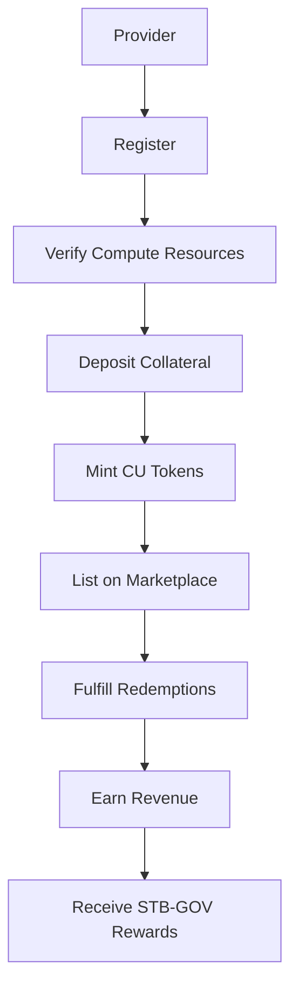
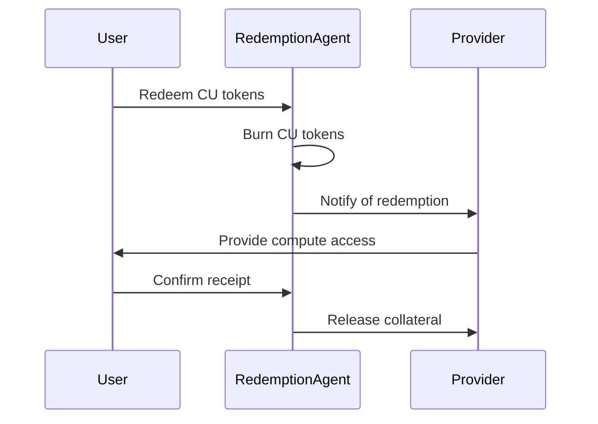

# Provider Guide

This guide explains how to become a compute provider in the STAB3L ecosystem, from registration to minting CU tokens and fulfilling redemption requests.


Compute providers are the backbone of the STAB3L ecosystem, offering standardized compute resources that are tokenized, traded, and utilized by users.


## Provider Overview

As a STAB3L compute provider, you can:

- Tokenize your compute resources as standardized CU tokens
- Earn revenue from users redeeming your CU tokens
- Participate in marketplace activities
- Earn STB-GOV rewards for providing reliable compute resources



## Becoming a Provider

### Registration Process



1. Connect your wallet to the STAB3L platform
2. Navigate to the "Provider" section
3. Click on "Register as Provider"
4. Fill in your provider details:
   - Provider name
   - Contact information
   - Company details (if applicable)
   - Hardware specifications
   - Geographic location
5. Submit your registration
6. Wait for approval from the STAB3L governance



```javascript
// Example API call to register as a provider
const response = await fetch('https://api.stab3l.io/provider/register', {
  method: 'POST',
  headers: {
    'Content-Type': 'application/json',
    'Authorization': `Bearer ${token}`
  },
  body: JSON.stringify({
    name: 'Example Provider',
    contactEmail: 'provider@example.com',
    companyName: 'Example Computing Inc.',
    hardwareSpecifications: {
      cpuType: 'AMD EPYC 7763',
      cpuCores: 64,
      ramGB: 512,
      storageGB: 10000,
      networkMbps: 10000
    },
    location: {
      country: 'United States',
      region: 'US-East'
    }
  })
});
```



### Provider Requirements

To become a STAB3L provider, you must meet the following requirements:

| Requirement | Description | Minimum Value |
|-------------|-------------|---------------|
| Hardware | Compute resources to offer | Server-grade hardware |
| Uptime | Guaranteed availability | 99.9% |
| Network | Network connectivity | 1 Gbps |
| Security | Security measures | Industry standard |
| Collateral | Collateral for minting | 120% of CU value |
| Identity | KYC verification | Required for large providers |


Provider requirements are enforced through the governance process. Providers who fail to meet these requirements may face penalties, including collateral slashing.


## Verifying Compute Resources

Before minting CU tokens, you must verify your compute resources through one of two methods:

### Zero-Knowledge Proof (ZKP) Verification



1. Download the STAB3L ZKP benchmarking tool
2. Run the tool on your compute resources
3. The tool generates benchmark results and a zero-knowledge proof
4. Submit the proof to the STAB3L platform
5. Verifiers check the proof's validity
6. If valid, your compute resources are verified



- Linux-based operating system
- Root access to the machine
- Internet connectivity
- Minimum 30 minutes of uninterrupted benchmarking time
- No other significant workloads running during benchmarking



- Privacy-preserving (hardware details remain private)
- Cryptographically secure
- No need for third-party verification
- Suitable for sensitive environments



### Trusted Execution Environment (TEE) Verification



1. Ensure your hardware supports TEE (Intel SGX, AMD SEV, etc.)
2. Download the STAB3L TEE benchmarking tool
3. Run the tool within the TEE
4. The TEE generates an attestation of the benchmark results
5. Submit the attestation to the STAB3L platform
6. If valid, your compute resources are verified



- Hardware with TEE support (Intel SGX, AMD SEV, etc.)
- TEE-compatible operating system
- Internet connectivity
- Minimum 30 minutes of uninterrupted benchmarking time



- Hardware-level security
- Tamper-resistant execution
- Remote attestation capabilities
- Higher level of trust



## Minting CU Tokens

Once your compute resources are verified, you can mint CU tokens:

1. Navigate to the "Mint" section
2. Select the verified compute resources
3. Specify the amount of CU tokens to mint
4. Deposit the required collateral (typically 120% of CU value)
5. Confirm the minting transaction
6. Your CU tokens will be minted and available for sale

### Collateralization

Providers must maintain sufficient collateral to back their minted CU tokens:

- **Initial Collateralization**: 120% of CU value
- **Minimum Collateralization**: 110% of CU value
- **Target Collateralization**: 150% of CU value (recommended)

If your collateralization ratio falls below the minimum, you will need to add more collateral or face liquidation.

### Minting Limits

Each provider has minting limits based on their verified compute resources:

- **Maximum CU Value**: Determined by your verified compute resources
- **Maximum Tokens per Mint**: 1,000 tokens
- **Cooling Period**: 24 hours between large mints (>500 tokens)

## Listing CU Tokens

After minting CU tokens, you can list them on the marketplace:

1. Navigate to the "Marketplace" section
2. Select "Create Listing"
3. Select the CU tokens you want to sell
4. Specify the amount and price per token
5. Confirm the listing transaction
6. Your CU tokens will be listed on the marketplace

### Pricing Strategies

Consider the following pricing strategies for your CU tokens:

<details>
<summary>Market-Based Pricing</summary>

Set prices based on current market conditions:
- Monitor the spot market for similar CU tokens
- Adjust prices regularly to remain competitive
- Consider offering volume discounts
</details>

<details>
<summary>Cost-Plus Pricing</summary>

Set prices based on your costs plus a profit margin:
- Calculate your operational costs (hardware, electricity, maintenance)
- Add a profit margin (typically 20-30%)
- Adjust for market conditions
</details>

<details>
<summary>Premium Pricing</summary>

Set higher prices for premium compute resources:
- Highlight unique features (high-end GPUs, specialized hardware)
- Emphasize reliability and performance
- Target specific use cases (AI training, rendering, etc.)
</details>

## Fulfilling Redemptions

When users redeem your CU tokens, you must fulfill their compute resource requests:

1. You'll receive a notification when a user redeems your CU tokens
2. Navigate to the "Redemptions" section
3. View the redemption details
4. Provide access to the compute resources within the specified timeframe
5. Confirm the fulfillment
6. A portion of your collateral will be released

### Redemption Process

The redemption process involves several steps:



### Fulfillment Requirements

You must fulfill redemption requests according to these requirements:

- **Response Time**: Within 1 hour of notification
- **Provisioning Time**: Within 24 hours of notification
- **Resource Matching**: Provide resources that match or exceed the CU token specifications
- **Duration**: Provide resources for the full duration specified in the CU token
- **Uptime**: Maintain 99.9% uptime during the provision period


Failure to fulfill redemption requests may result in penalties, including collateral slashing and reputation damage.


## Provider Dashboard

The Provider Dashboard gives you an overview of your provider activities:

- **Minted Tokens**: Number and value of CU tokens you've minted
- **Active Listings**: Your current marketplace listings
- **Redemptions**: Pending and completed redemption requests
- **Collateral**: Current collateralization ratio and status
- **Rewards**: STB-GOV rewards earned from provider activities
- **Reputation**: Your provider reputation score

## Provider Reputation System

STAB3L includes a reputation system for providers:

- **Initial Reputation**: All new providers start with a neutral reputation
- **Positive Factors**: Successful redemptions, high uptime, quick response time
- **Negative Factors**: Failed redemptions, low uptime, slow response time
- **Reputation Score**: Ranges from 0 to 100
- **Benefits**: Higher reputation leads to higher visibility in the marketplace and potentially higher prices

## Advanced Provider Features

### Automated Fulfillment

Set up automated fulfillment for redemption requests:

1. Navigate to the "Provider Settings" section
2. Click on "Automated Fulfillment"
3. Configure your automation settings:
   - API endpoints
   - Authentication credentials
   - Resource allocation rules
4. Test the automation
5. Enable automated fulfillment

### Provider API

Use the Provider API to integrate STAB3L with your existing systems:

```javascript
// Example API call to check pending redemptions
const response = await fetch('https://api.stab3l.io/provider/redemptions/pending', {
  method: 'GET',
  headers: {
    'Authorization': `Bearer ${token}`
  }
});

// Example API call to fulfill a redemption
const fulfillResponse = await fetch(`https://api.stab3l.io/provider/redemptions/${redemptionId}/fulfill`, {
  method: 'POST',
  headers: {
    'Content-Type': 'application/json',
    'Authorization': `Bearer ${token}`
  },
  body: JSON.stringify({
    accessDetails: {
      endpoint: 'https://compute.example.com',
      username: 'user123',
      password: 'generated_password',
      expirationTime: 1672531200 // Unix timestamp
    }
  })
});
```

### Batch Operations

Perform batch operations to save time and gas costs:

- **Batch Minting**: Mint multiple CU tokens in a single transaction
- **Batch Listing**: Create multiple marketplace listings at once
- **Batch Fulfillment**: Fulfill multiple redemption requests simultaneously

## Best Practices for Providers


Following these best practices will help you succeed as a STAB3L provider.


### Resource Management

1. **Overprovisioning**: Maintain a buffer of available resources (20-30% recommended)
2. **Monitoring**: Implement robust monitoring of your compute resources
3. **Maintenance**: Schedule regular maintenance during low-demand periods
4. **Scaling**: Plan for scaling your resources to meet growing demand

### Financial Management

1. **Collateral Management**: Maintain a healthy collateralization ratio (150% recommended)
2. **Pricing Strategy**: Regularly review and adjust your pricing strategy
3. **Revenue Diversification**: Offer different types of compute resources
4. **Risk Management**: Set aside reserves for unexpected events

### Customer Service

1. **Response Time**: Respond to user inquiries promptly
2. **Documentation**: Provide clear documentation for using your compute resources
3. **Support Channels**: Offer multiple support channels (email, chat, forum)
4. **Feedback Loop**: Collect and act on user feedback

## Conclusion

Becoming a STAB3L provider offers a way to monetize your compute resources in a standardized, secure, and efficient manner. By following this guide, you can successfully register, verify your resources, mint CU tokens, and fulfill redemption requests, all while maintaining a good reputation and earning rewards. 