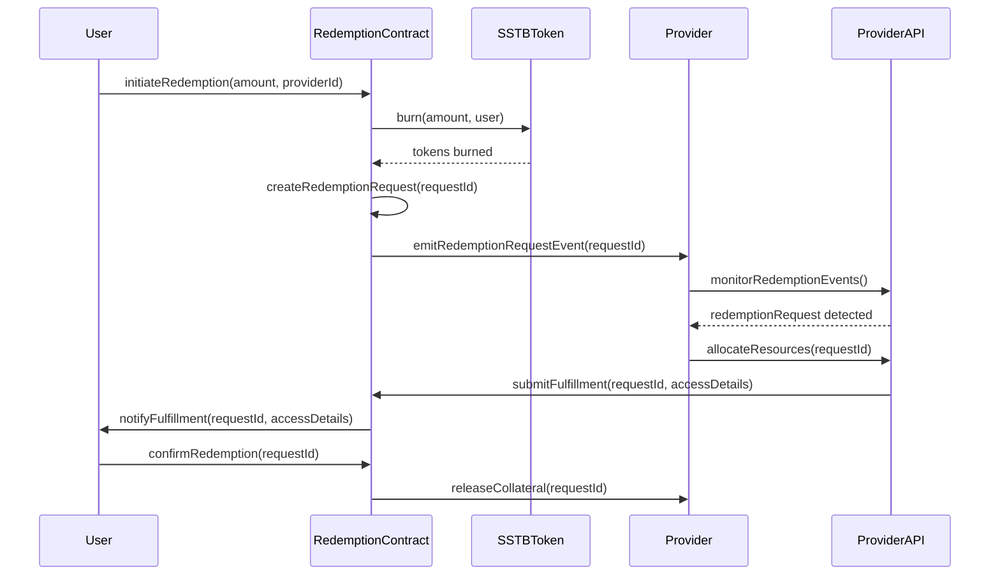

# Redemption Process

This document explains the process of redeeming sSTB tokens for actual compute resources on the STAB3L platform. The redemption process is a critical component that connects the on-chain tokenized representation of compute resources to their off-chain delivery and utilization.

## Overview

Redemption is the process through which users exchange their sSTB tokens for the actual compute resources they represent. When a user redeems sSTB tokens, the tokens are burned, and the provider is notified to fulfill the redemption request by providing access to the specified compute resources.


Redemption is the final step in the STAB3L value chain, connecting the on-chain token economy to real-world compute resources.


## Redemption Flow

The redemption process follows these steps:

1. **Redemption Request**: User initiates a redemption request for their sSTB tokens

2. **Token Burning**: sSTB tokens are burned (removed from circulation)

3. **Provider Notification**: Provider is notified of the redemption request

4. **Resource Allocation**: Provider allocates the requested compute resources

5. **Access Provision**: Provider provides access credentials to the user

6. **Verification**: User verifies access to the compute resources

7. **Completion**: Redemption is marked as complete











## Detailed Redemption Steps

### 1. Initiating a Redemption Request

To initiate a redemption request:

1. Navigate to the "Redeem" section of the STAB3L platform
2. Select the amount of sSTB tokens you want to redeem
3. Choose a provider from the available options
4. Review the redemption details, including:
   - Provider information
   - Compute resource specifications
   - Estimated fulfillment time
   - Expiration date (if applicable)
5. Confirm the redemption request







```javascript
// Example API request to initiate redemption
const initiateRedemption = async (amount, providerId) => {
  const response = await fetch('https://api.stab3l.com/v1/redemptions', {
    method: 'POST',
    headers: {
      'Content-Type': 'application/json',
      'Authorization': `Bearer ${apiKey}`
    },
    body: JSON.stringify({
      sstb_amount: amount,
      provider_id: providerId
    })
  });
  
  const data = await response.json();
  return data.redemption_id;
};
```



```solidity
// SPDX-License-Identifier: MIT
pragma solidity ^0.8.17;

import "@openzeppelin/contracts/token/ERC20/IERC20.sol";
import "@openzeppelin/contracts/security/ReentrancyGuard.sol";

contract RedemptionManager is ReentrancyGuard {
    IERC20 public sstbToken;
    
    struct RedemptionRequest {
        address user;
        uint256 amount;
        uint256 timestamp;
        address provider;
        bool fulfilled;
        bool confirmed;
    }
    
    mapping(uint256 => RedemptionRequest) public redemptionRequests;
    uint256 public nextRedemptionId = 1;
    
    event RedemptionInitiated(
        uint256 indexed redemptionId,
        address indexed user,
        uint256 amount,
        address provider
    );
    
    event RedemptionFulfilled(
        uint256 indexed redemptionId,
        address indexed provider,
        string accessDetails
    );
    
    event RedemptionConfirmed(
        uint256 indexed redemptionId,
        address indexed user
    );
    
    constructor(address _sstbToken) {
        sstbToken = IERC20(_sstbToken);
    }
    
    function initiateRedemption(
        uint256 amount,
        address provider
    ) external nonReentrant returns (uint256) {
        // Burn the sSTB tokens
        sstbToken.transferFrom(msg.sender, address(0x... (PLACEHOLDER)), amount);
        
        // Create redemption request
        uint256 redemptionId = nextRedemptionId++;
        redemptionRequests[redemptionId] = RedemptionRequest({
            user: msg.sender,
            amount: amount,
            timestamp: block.timestamp,
            provider: provider,
            fulfilled: false,
            confirmed: false
        });
        
        emit RedemptionInitiated(
            redemptionId,
            msg.sender,
            amount,
            provider
        );
        
        return redemptionId;
    }
    
    function fulfillRedemption(
        uint256 redemptionId,
        string calldata accessDetails
    ) external nonReentrant {
        RedemptionRequest storage request = redemptionRequests[redemptionId];
        
        require(msg.sender == request.provider, "Only provider can fulfill");
        require(!request.fulfilled, "Already fulfilled");
        
        request.fulfilled = true;
        
        emit RedemptionFulfilled(
            redemptionId,
            msg.sender,
            accessDetails
        );
    }
    
    function confirmRedemption(
        uint256 redemptionId
    ) external nonReentrant {
        RedemptionRequest storage request = redemptionRequests[redemptionId];
        
        require(msg.sender == request.user, "Only user can confirm");
        require(request.fulfilled, "Not fulfilled yet");
        require(!request.confirmed, "Already confirmed");
        
        request.confirmed = true;
        
        // Release provider's collateral
        // Implementation depends on collateral management system
        
        emit RedemptionConfirmed(
            redemptionId,
            msg.sender
        );
    }
}
```



### 2. Token Burning

When a redemption request is initiated, the sSTB tokens are burned (removed from circulation). This process:

- Ensures that tokens can only be redeemed once
- Reduces the total supply of sSTB tokens
- Creates a permanent record of the redemption on the blockchain

The token burning is handled automatically by the redemption smart contract.

### 3. Provider Notification

After the tokens are burned, the provider is notified of the redemption request through:

- On-chain events emitted by the redemption contract
- Off-chain notifications via the STAB3L API
- Email alerts (if configured by the provider)

Providers monitor these notifications to fulfill redemption requests promptly.

### 4. Resource Allocation

Upon receiving a redemption request, the provider:

1. Verifies the redemption details
2. Allocates the requested compute resources
3. Configures the resources according to the specifications
4. Prepares access credentials for the user

The provider must allocate resources that match or exceed the specifications corresponding to the redeemed sSTB tokens.

### 5. Access Provision

The provider provides access to the compute resources through:

1. Submitting access details to the redemption contract
2. Sending access credentials directly to the user via secure channels
3. Configuring access controls to allow the user to utilize the resources

Access details typically include:

- IP addresses or hostnames
- Authentication credentials
- API keys or access tokens
- Connection instructions



```json
{
  "redemption_id": "12345",
  "access_type": "ssh",
  "hostname": "compute-node-42.provider.stab3l.com",
  "port": 22,
  "username": "stab3l-user-12345",
  "ssh_key": "ssh-rsa AAAAB3NzaC1yc2EAAAADAQABAAABAQC...",
  "expiration": "2023-12-31T23:59:59Z",
  "resources": {
    "cpu_cores": 8,
    "memory_gb": 32,
    "storage_gb": 500,
    "bandwidth_mbps": 1000
  },
  "documentation_url": "https://docs.provider.stab3l.com/getting-started"
}
```



### 6. Verification

After receiving access details, the user:

1. Connects to the provided compute resources
2. Verifies that the resources match the specifications of the redeemed sSTB tokens
3. Confirms the redemption if the resources are satisfactory

If the resources do not match the specifications, the user can initiate a dispute.

### 7. Completion

Once the user confirms the redemption:

1. The redemption is marked as complete
2. The provider's collateral for the redeemed tokens is released
3. The provider's reputation score is updated positively

## Redemption Timeframes

Providers must fulfill redemption requests within specific timeframes based on the quality tier:

| Quality Tier | Maximum Fulfillment Time |
|---------------|--------------------------|
| Standard      | 24 hours                 |
| Premium       | 6 hours                  |
| Enterprise    | 1 hour                   |

Failure to fulfill redemption requests within these timeframes may result in penalties for the provider.

## Dispute Resolution

If a provider fails to fulfill a redemption request or provides resources that do not match the specifications, users can initiate a dispute:

1. Navigate to the "Redemptions" section
2. Select the unfulfilled or unsatisfactory redemption
3. Click "Report Issue" and provide details
4. Submit the dispute

The dispute resolution process involves:

1. **Investigation**: The STAB3L team investigates the dispute
2. **Provider Response**: The provider is given an opportunity to respond
3. **Resolution**: The dispute is resolved based on the evidence
4. **Compensation**: If the provider is at fault, the user is compensated from the provider's collateral
5. **Penalties**: The provider may face additional penalties, such as reputation damage or suspension


Disputes should be initiated within 72 hours of the redemption request or access provision.


## Provider Collateral

To ensure that providers fulfill redemption requests, they must maintain collateral:

- Providers deposit collateral when offering compute resources
- Collateral is typically 120% of the value of the compute resources
- Collateral is locked until the corresponding redemptions are confirmed
- If a provider fails to fulfill redemption requests, their collateral may be used to compensate users

This collateral system creates strong economic incentives for providers to fulfill their obligations.

## Redemption Fees

Redemption involves the following fees:

| Fee Type | Amount | Recipient |
|----------|--------|-----------|
| Redemption Fee | 0.1% of CU value | STAB3L Treasury |
| Gas Fee | Variable | Network |

These fees are paid by the user when initiating the redemption request.

## Redemption API

STAB3L provides a comprehensive API for managing redemptions programmatically:



```javascript
// POST /v1/redemptions
const initiateRedemption = async (amount, providerId) => {
  const response = await fetch('https://api.stab3l.com/v1/redemptions', {
    method: 'POST',
    headers: {
      'Content-Type': 'application/json',
      'Authorization': `Bearer ${apiKey}`
    },
    body: JSON.stringify({
      sstb_amount: amount,
      provider_id: providerId
    })
  });
  
  return await response.json();
};
```



```javascript
// GET /v1/redemptions/{redemptionId}
const getRedemptionStatus = async (redemptionId) => {
  const response = await fetch(`https://api.stab3l.com/v1/redemptions/${redemptionId}`, {
    method: 'GET',
    headers: {
      'Authorization': `Bearer ${apiKey}`
    }
  });
  
  return await response.json();
};
```



```javascript
// POST /v1/redemptions/{redemptionId}/confirm
const confirmRedemption = async (redemptionId) => {
  const response = await fetch(`https://api.stab3l.com/v1/redemptions/${redemptionId}/confirm`, {
    method: 'POST',
    headers: {
      'Content-Type': 'application/json',
      'Authorization': `Bearer ${apiKey}`
    }
  });
  
  return await response.json();
};
```



```javascript
// POST /v1/redemptions/{redemptionId}/dispute
const reportIssue = async (redemptionId, issueDetails) => {
  const response = await fetch(`https://api.stab3l.com/v1/redemptions/${redemptionId}/dispute`, {
    method: 'POST',
    headers: {
      'Content-Type': 'application/json',
      'Authorization': `Bearer ${apiKey}`
    },
    body: JSON.stringify({
      issue_type: issueDetails.type,
      description: issueDetails.description,
      evidence: issueDetails.evidence
    })
  });
  
  return await response.json();
};
```



## Best Practices for Redemption

### For Users

- **Verify Provider Reputation**: Check the provider's reputation score before redeeming sSTB tokens

- **Read Specifications Carefully**: Understand the exact specifications of the compute resources you're redeeming

- **Test Promptly**: Test the provided resources as soon as you receive access

- **Document Everything**: Keep records of all communications and access details

- **Report Issues Quickly**: If there are any issues, report them within the 72-hour window

### For Providers

- **Monitor Redemption Requests**: Set up automated monitoring for redemption requests

- **Fulfill Promptly**: Fulfill redemption requests as quickly as possible

- **Provide Clear Instructions**: Give users clear and detailed access instructions

- **Maintain Resource Availability**: Ensure you have sufficient resources to fulfill all potential redemptions

- **Communicate Proactively**: If there are any delays or issues, communicate with users proactively

## Redemption Lifecycle Management

### Resource Expiration

Compute resources may have an expiration date, after which they can no longer be accessed. Users should be aware of these expiration dates and plan accordingly.

### Resource Renewal

Some providers offer renewal options for redeemed compute resources. To renew:

1. Navigate to the "Redemptions" section
2. Select the redemption you want to renew
3. Click "Renew" and follow the instructions
4. Redeem additional sSTB tokens if necessary

### Resource Termination

When a user no longer needs the compute resources:

1. Navigate to the "Redemptions" section
2. Select the redemption you want to terminate
3. Click "Terminate" and confirm
4. The provider will reclaim the resources

## Conclusion

The redemption process is the critical link between the on-chain tokenized representation of compute resources and their off-chain delivery and utilization. By following the steps outlined in this document, users can successfully redeem their sSTB tokens for actual compute resources, and providers can fulfill their obligations efficiently.


The STAB3L redemption system is designed to be secure, efficient, and fair for both users and providers, creating a trustless marketplace for compute resources.
 